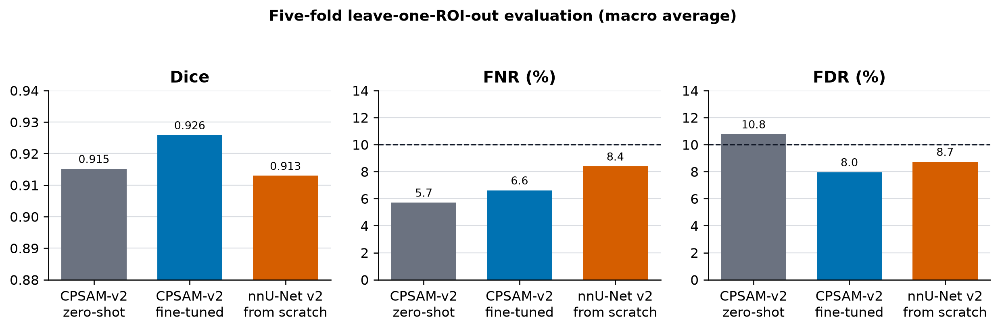

# DAPI 细胞核分割

本仓库完成一张 15000x11496 DAPI 全图的细胞核二值分割，并在 5 个带人工 Mask 的
256x256 ROI 上比较 Cellpose-SAM 与 nnU-Net v2。两条路线分别完成交叉验证、全量
训练和整图推理；另使用两套公开数据模拟归一化预测熵驱动的主动选样。

完整实验设计和结果见 [技术报告](docs/REPORT.md)；排版版见
[PDF](docs/REPORT.pdf)。

## ROI 结果

表中结果为 5 个 ROI 的宏平均；微调和从头训练采用 5 折留一 ROI。FNR 和 FDR
均按像素计算。

| 方法 | Dice | FNR | FDR |
|---|---:|---:|---:|
| Cellpose-SAM 直接推理 | 0.9152 | 5.70% | 10.76% |
| Cellpose-SAM 微调 | **0.9259** | **6.61%** | **7.95%** |
| nnU-Net v2 从头训练 | 0.9130 | 8.38% | 8.73% |



## 公开数据主动选样

候选块按归一化预测熵排序，每块取熵最高 10% 像素的平均值；高熵与随机策略使用
相同的 20 块标注预算，同一公开视野最多选择 1 块。选样阶段只读取模型概率，公开
标注用于随后评价和微调。

| 数据 | 候选块 | 高熵块错误 | 随机块错误 |
|---|---:|---:|---:|
| BBBC039 | 600 | 14.82% | 10.66% |
| SPATCH DAPI | 747 |24.89% | 20.66% |

两套数据中，高熵样本的实际错误均高于随机样本。

SPATCH 高熵样本的 DAPI、人工 Mask、原模型预测和熵图见
[样本示例](results/figures/active_learning_entropy_examples.png)。

SPATCH 高熵 20 块与目标训练数据按 1:1 采样后得到 nnU-Net fold 0 模型。阈值
0.571 下，留出 ROI 的 Dice、FNR、FDR 分别为 0.9105、7.92% 和 9.95%。
[五张 ROI 指标](results/active_learning/entropy_model_per_roi.csv)和
[逐 ROI 结果图](results/figures/entropy_model_roi_results.png)均已保存。

## 整图结果

Cellpose-SAM、nnU-Net 和归一化熵模型均输出同尺寸二值 TIFF：

| 方法 | 完整 Mask | 文件信息 | 抽检图 |
|---|---|---|---|
| Cellpose-SAM | [Mask](results/full_image/cellpose_sam_mask.tif) | [JSON](results/full_image/cellpose_sam_mask.json) | [PNG](results/figures/cellpose_sam_full_overview.png) |
| nnU-Net v2 | [Mask](results/full_image/nnunet_mask.tif) | [JSON](results/full_image/nnunet_mask.json) | [PNG](results/figures/nnunet_full_overview.png) |
| nnU-Net + SPATCH 高熵 | [Mask](results/full_image/nnunet_entropy_spatch_mask.tif) | [JSON](results/full_image/nnunet_entropy_spatch_mask.json) | [PNG](results/figures/nnunet_entropy_spatch_full_overview.png) |

三种模型在相同位置的局部结果见
[整图抽检对比](results/figures/full_image_method_comparison.png)。

## 目录

```text
.
├── configs/                 # 模型参数和交叉验证划分
├── data/annotations/        # 5 组 ROI 与人工二值标注
├── docs/                    # Markdown 与 PDF 实验报告
├── results/
│   ├── full_image/          # 三种模型的完整 Mask 与元数据
│   ├── active_learning/     # 公开数据选样与归一化熵模型指标
│   ├── roi_predictions/     # 5 折留出预测
│   ├── figures/             # 指标、主动选样、ROI 和整图图表
│   └── metrics_*.csv/json   # 逐图与汇总指标
├── scripts/                 # 训练、评估和整图推理入口
├── src/                     # 数据处理、模型流程和指标代码
└── tests/                   # 指标单元测试
```

原始全图和模型权重不放入仓库。全图从作业数据目录读取；Cellpose-SAM 权重由
`train-all` 生成，nnU-Net 权重由全量训练生成。

## 环境与复现

建议使用 Python 3.12。复核已有 Mask 和指标：

```bash
python3 -m venv .venv
source .venv/bin/activate
pip install -r requirements.txt
./scripts/evaluate.sh
```

Cellpose-SAM：

```bash
pip install -r requirements-cellpose.txt
./scripts/run_cellpose.sh zero-shot
./scripts/run_cellpose.sh cross-validation
./scripts/run_cellpose.sh train-all
./scripts/infer_cellpose_full.sh /absolute/path/to/Y00039K4_DAPI_transformed-c.tif
```

nnU-Net v2：

```bash
pip install -r requirements-nnunet.txt
./scripts/run_nnunet.sh
./scripts/infer_nnunet_full.sh /absolute/path/to/Y00039K4_DAPI_transformed-c.tif
```

对候选概率图执行归一化预测熵排序：

```bash
python src/rank_uncertain_patches.py pool_predictions.npz selected_patches.csv \
  --budget 20 --top-fraction 0.1
```

输入 NPZ 包含 `probabilities`、`patch_ids` 和 `source_ids`。公开数据下载、候选块生成
和 nnU-Net 微调流程见
[`cell_seg_nnunet_hd`](https://github.com/Morwey/cell_seg_nnunet_hd)。
选定模型的逐 ROI 评价和整图入口分别为 `src/evaluate_entropy_model.py` 与
`src/infer_entropy_nnunet_full.py`。

同时运行两条整图路线：

```bash
./scripts/infer_full_image.sh /absolute/path/to/Y00039K4_DAPI_transformed-c.tif
```

设备默认自动选择。可通过 `CELLPOSE_DEVICE`、`CELLPOSE_BATCH_SIZE` 和
`NNUNET_DEVICE` 调整推理设备与批量大小。
