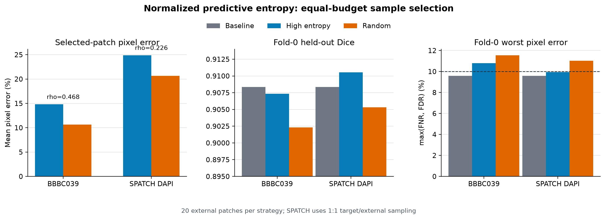
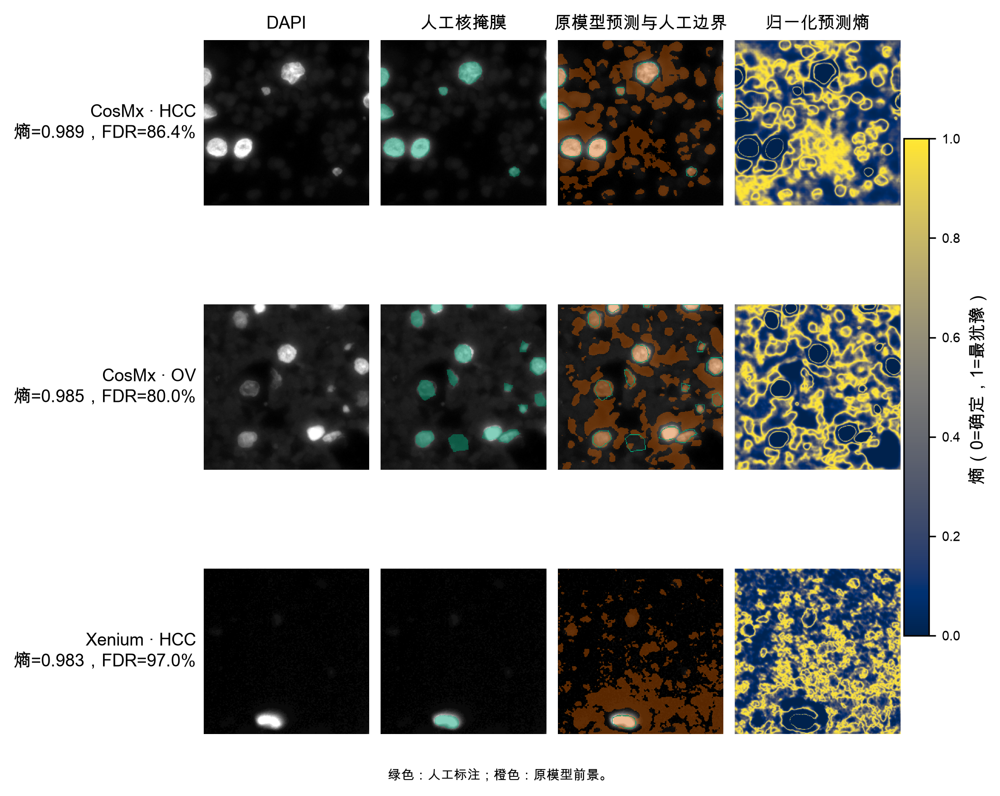
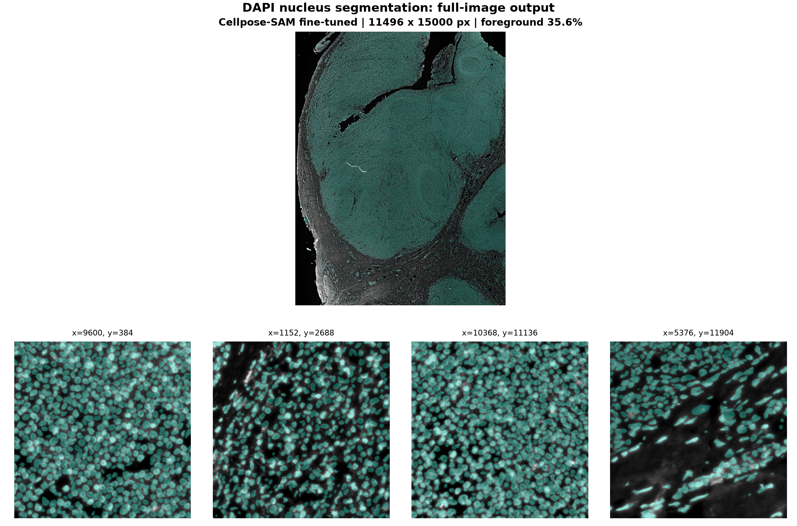
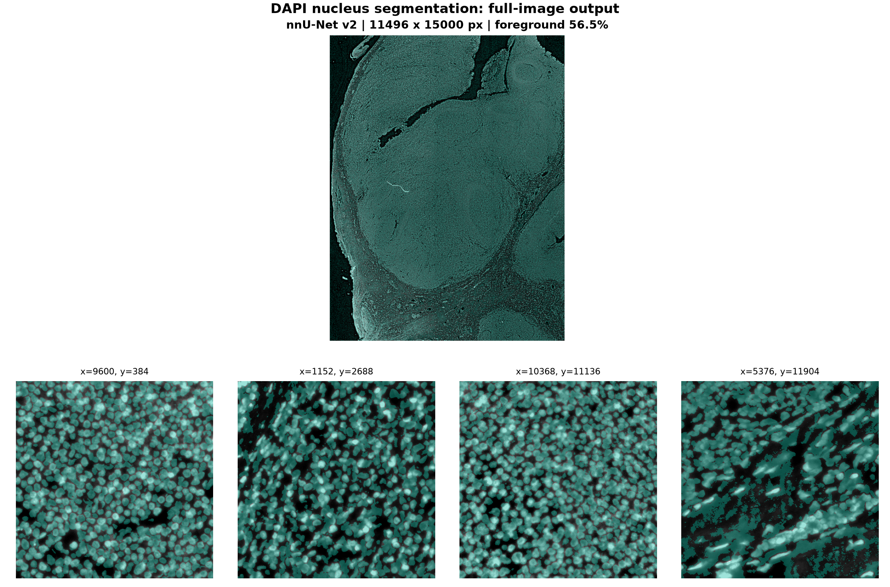

# DAPI 细胞核分割实验报告

## 摘要

本实验完成一张 15000x11496 DAPI 图像的细胞核二值分割，并使用 5 个带人工 Mask
的 256x256 ROI 评价模型。实验包含两条独立路线：以 Cellpose-SAM 预训练权重为
起点进行直接推理和任务内微调；使用 nnU-Net v2 从头训练。微调与从头训练均采用
5 折留一 ROI 验证，整图模型均使用全部 5 个 ROI 训练。

Cellpose-SAM 微调的宏平均 Dice 为 0.9259，FNR 为 6.61%，FDR 为 7.95%；
nnU-Net 的对应结果为 0.9130、8.38% 和 8.73%。Cellpose-SAM 微调取得最高 Dice，
nnU-Net 的漏检和误检比例接近。两种方法分别生成与原图同尺寸的完整二值 Mask，
并在相同位置进行整图抽检。

在 nnU-Net 路线上，另以 BBBC039 和 SPATCH DAPI 构建候选池，模拟固定 20 块标注
预算。归一化预测熵在两套数据中均富集了实际高错误区域；SPATCH 采用目标数据与
外部数据 1:1 采样后，高熵组留出 Dice 为 0.9105，高于随机组的 0.9053 和原模型
的 0.9083。

## 1. 任务与数据

### 1.1 输入和输出

| 项目 | 内容 |
|---|---|
| 完整图像 | 单通道 8-bit TIFF，15000x11496 |
| 标注数据 | 5 张 256x256 DAPI ROI 及对应人工 Mask |
| 标注格式 | `uint8`，背景 0、细胞核 255 |
| 输出格式 | 与完整图像同尺寸的二值 TIFF，背景 0、细胞核 255 |

人工标注为二值区域。实验统一按二值分割计算指标。Cellpose-SAM 的实例标签在输出
阶段转换为 `labels > 0`，与 nnU-Net 的前景类别使用相同评价口径。

### 1.2 数据检查

5 张 ROI Mask 的前景比例为 59.5%-70.9%，均属于核密集区域。对二值 Mask 做
4 连通域编号并去除小于 20 像素的碎片后，共得到 291 个训练实例，用于适配
Cellpose-SAM 的实例标签接口。

多尺度模板匹配在全图中定位到 3 张 ROI，对应的有效分辨率比为 2.0445。两张图像
中的细胞核尺度约相差一倍。Cellpose-SAM 训练加入低分辨率副本；nnU-Net 整图推理
前按该比例调整图像尺度。

## 2. 评价方法

像素级混淆矩阵中，TP 为预测与标注共同的前景像素，FP 为预测多出的前景像素，
FN 为遗漏的前景像素。主要指标为：

\[
Dice = 2TP / (2TP + FP + FN),\quad
FNR = FN / (TP + FN),\quad
FDR = FP / (TP + FP)
\]

FNR 对应漏检比例，FDR 对应预测前景中的误检比例。题目给出的 10% 条件按
`FNR < 10%` 且 `FDR < 10%` 统计。

宏平均先计算每张 ROI 的指标，再对 5 张图等权平均；像素合并结果则汇总全部 ROI
的 TP、FP 和 FN。Cellpose-SAM 微调和 nnU-Net 从头训练使用固定的 5 折划分：
每折 4 张训练、1 张测试。阈值选择在训练折内完成。

## 3. 方法

### 3.1 Cellpose-SAM 直接推理

Cellpose-SAM 使用 SAM ViT-L 图像编码器预测细胞概率和二维流场，再通过 Cellpose
dynamics 得到实例 Mask。本实验加载 `cpsam_v2` 预训练权重，参数为：

| 参数 | 值 |
|---|---:|
| diameter | 30.4 px |
| cellprob threshold | 0.0 |
| flow threshold | 0.4 |
| min size | 20 px |

5 张 ROI 直接进入模型，人工 Mask 用于结果统计。

### 3.2 Cellpose-SAM 微调

每折从同一份预训练权重开始，以 4 张 ROI 训练，并在第 5 张 ROI 上测试。训练参数
如下：

| 参数 | 值 |
|---|---:|
| epoch | 30 |
| 每个 epoch 采样图数 | 4 |
| batch size | 1 |
| learning rate | 1e-5 |
| weight decay | 0.1 |
| crop size | 256x256 |

每张训练图增加一个模拟低分辨率副本，并使用随机旋转、翻转和尺度变化。二值标注经
4 连通域编号后进入训练接口。每折的 `cellprob_threshold` 和 `flow_threshold` 在
4 张训练 ROI 上选择，留出 ROI 使用选定参数推理。

整图模型沿用相同设置，以全部 5 张 ROI 及低分辨率副本完成训练。

### 3.3 nnU-Net v2 从头训练

nnU-Net 根据数据指纹生成 2D 配置。本实验使用 PlainConvUNet，7 个尺度的通道数
依次为 32、64、128、256、512、512、512，参数量约 3347 万。损失函数为 Dice
与交叉熵，开启深监督；输入按单图 z-score 归一化，patch size 为 256x256，batch
size 为 2。

5 折实验使用 `nnUNetTrainer_5epochs`，每个 epoch 250 个 batch，验证阈值固定为
0.5。整图模型使用相同训练器和全部 5 张 ROI。

## 4. ROI 实验结果

### 4.1 宏平均

| 方法 | Dice | FNR | FDR | 两项均低于 10% |
|---|---:|---:|---:|---:|
| Cellpose-SAM 直接推理 | 0.9152 | 5.70% | 10.76% | 1/5 |
| Cellpose-SAM 微调 | **0.9259** | **6.61%** | **7.95%** | 2/5 |
| nnU-Net v2 从头训练 | 0.9130 | 8.38% | 8.73% | 2/5 |

Cellpose-SAM 直接推理的 FNR 为 5.70%，FDR 为 10.76%，预测边界整体偏宽。微调后
FDR 下降 2.81 个百分点，Dice 提高 0.0107，FNR 上升 0.91 个百分点。nnU-Net 的
FNR 与 FDR 相差 0.35 个百分点，二者分布较为接近。

### 4.2 像素合并结果

| 方法 | Dice | FNR | FDR |
|---|---:|---:|---:|
| Cellpose-SAM 直接推理 | 0.9150 | 5.90% | 10.96% |
| Cellpose-SAM 微调 | **0.9256** | **6.83%** | **8.05%** |
| nnU-Net v2 从头训练 | 0.9128 | 8.67% | 8.78% |

像素合并与宏平均的排序一致。

### 4.3 逐 ROI 结果

| ROI | Cellpose-SAM Dice | Cellpose-SAM FNR | Cellpose-SAM FDR | nnU-Net Dice | nnU-Net FNR | nnU-Net FDR |
|---:|---:|---:|---:|---:|---:|---:|
| 1 | 0.9112 | 7.88% | 9.86% | 0.9086 | 8.08% | 10.17% |
| 2 | 0.9203 | 4.26% | 11.40% | 0.9064 | 8.97% | 9.76% |
| 3 | 0.9367 | 1.75% | 10.50% | 0.9281 | 2.61% | 11.35% |
| 4 | 0.9461 | 5.89% | 4.88% | 0.9251 | 5.87% | 9.06% |
| 5 | 0.9152 | 13.27% | 3.14% | 0.8968 | 16.39% | 3.30% |

ROI 2、3 的 Cellpose-SAM 预测边界偏宽；ROI 5 的低对比度边界出现漏分。nnU-Net
在 ROI 5 的 FNR 较高，在 ROI 3 的 FDR 较高。ROI 4 是两种方法表现最稳定的区域。

逐 ROI 混淆矩阵与指标见
[`results/metrics_per_roi.csv`](../results/metrics_per_roi.csv)。

### 4.4 分辨率实验

| Cellpose-SAM 设置 | 输入 | Dice | FNR | FDR |
|---|---|---:|---:|---:|
| 直接推理 | 原始 ROI | 0.9152 | 5.70% | 10.76% |
| 直接推理 | 模拟低分辨率 | 0.9057 | 5.21% | 12.84% |
| 微调 | 原始 ROI | 0.9259 | 6.61% | 7.95% |
| 微调 | 模拟低分辨率 | 0.9235 | 6.53% | 8.46% |

加入低分辨率副本后，模拟低分辨率输入的 Dice 与原始 ROI 相差 0.0024；FNR 和 FDR
分别相差 0.08 和 0.51 个百分点。

## 5. 公开数据主动选样

### 5.1 候选池与评分

| 数据 | 图像与标注 | 候选块 | 预处理 |
|---|---|---:|---|
| BBBC039 | 100 张训练图，Hoechst 核图像及人工 Mask | 600 | 每张图提取 6 个 256x256 块 |
| SPATCH DAPI | COAD、HCC、OV 共 30 个视野及人工核边界 | 750 | 按核尺度缩放 0.727 后提取 256x256 块 |

对于模型输出的前景概率 \(p\)，归一化二元预测熵定义为：

\[
H(p) = [-p ln(p) - (1-p) ln(1-p)] / ln(2)
\]

每个候选块以熵最高 10% 像素的平均值作为不确定性分数。两套数据均固定选择 20
个块，每张原图最多取 1 个，避免少数视野占满预算。三组选择策略使用相同候选池：

| 策略 | 选择依据 | 数量 |
|---|---|---:|
| 高熵 | 预测概率 | 20 |
| 随机 | 候选块编号，随机种子 20260811 | 20 |
| 熵与难例混合 | 10 个高熵块、5 个高 FDR 块、5 个高 FNR 块 | 20 |

高熵和随机策略模拟未标注池选样；熵与难例混合策略使用公开 Mask 计算 FDR 和 FNR，
作为监督难例挖掘对照。

### 5.2 选样结果

| 数据 | 有效候选块 | 熵与像素错误率 Spearman rho | 高熵组错误率 | 随机组错误率 |
|---|---:|---:|---:|---:|
| BBBC039 | 600 | 0.468 | 14.82% | 10.66% |
| SPATCH DAPI | 747 | 0.226 | 24.89% | 20.66% |

两套公开数据中，高熵组的实际像素错误率均高于随机组。归一化预测熵能够优先找到
当前模型边界不稳定、前景判定困难的图像块。

SPATCH 高熵样例同时展示 DAPI、人工 Mask、模型边界与预测熵；高熵主要集中在核
边界、粘连区域和低对比度结构。

### 5.3 等预算微调

补充实验固定使用 fold 0、相同初始化和训练器，目标域由 4 张训练 ROI 与 1 张留出
ROI 组成，阈值在 4 张训练 ROI 上确定。BBBC039 直接加入 20 个外部块；SPATCH
同时比较目标数据与外部数据 4:20 和 20:20 两种采样比例。

| 数据 | 策略 | 目标:外部 | Dice | FNR | FDR |
|---|---|---:|---:|---:|---:|
| BBBC039 | 原模型 | 4:0 | 0.9083 | 8.73% | 9.60% |
| BBBC039 | 高熵 | 4:20 | 0.9073 | 7.69% | 10.80% |
| BBBC039 | 熵与难例混合 | 4:20 | 0.9074 | 7.48% | 10.97% |
| BBBC039 | 随机 | 4:20 | 0.9023 | 7.91% | 11.55% |
| SPATCH DAPI | 原模型 | 4:0 | 0.9083 | 8.73% | 9.60% |
| SPATCH DAPI | 高熵 | 4:20 | 0.9070 | 7.70% | 10.86% |
| SPATCH DAPI | 熵与难例混合 | 4:20 | 0.8996 | 7.70% | 12.27% |
| SPATCH DAPI | 随机 | 4:20 | 0.9013 | 9.66% | 10.07% |
| SPATCH DAPI | 高熵 | 20:20 | **0.9105** | 7.92% | **9.95%** |
| SPATCH DAPI | 随机 | 20:20 | 0.9053 | **7.85%** | 11.03% |

BBBC039 高熵组优于随机组，原模型 Dice 最高。SPATCH 在 4:20 采样时三组均低于
原模型；调整为 1:1 后，高熵组比随机组高 0.0052 Dice，并比原模型高 0.0022。
选样分数决定外部数据的优先级，目标域与外部数据的采样比例共同影响微调结果。

## 6. 整图推理

### 6.1 Cellpose-SAM

全量模型由 5 张 ROI 及其低分辨率副本训练。整图在原图尺度分成 1536x1536 分块，
每块增加 64 像素上下文，网络批量大小为 32。输出使用
`cellprob_threshold=0.0`、`flow_threshold=0.4`，实例标签转为二值 Mask 后拼接。

| 结果 | 路径 |
|---|---|
| 完整 Mask | [`results/full_image/cellpose_sam_mask.tif`](../results/full_image/cellpose_sam_mask.tif) |
| 元数据 | [`results/full_image/cellpose_sam_mask.json`](../results/full_image/cellpose_sam_mask.json) |
| 抽检图 | [`results/figures/cellpose_sam_full_overview.png`](../results/figures/cellpose_sam_full_overview.png) |

### 6.2 nnU-Net v2

全量模型由 5 张 ROI 从头训练。原图先按 2.0445 倍双三次插值，nnU-Net 使用
256x256 滑窗完成推理；0.5 阈值得到二值结果，再以最近邻插值恢复至
15000x11496。

| 结果 | 路径 |
|---|---|
| 完整 Mask | [`results/full_image/nnunet_mask.tif`](../results/full_image/nnunet_mask.tif) |
| 元数据 | [`results/full_image/nnunet_mask.json`](../results/full_image/nnunet_mask.json) |
| 抽检图 | [`results/figures/nnunet_full_overview.png`](../results/figures/nnunet_full_overview.png) |

### 6.3 相同位置抽检

整图抽检固定 4 个坐标，覆盖高密度核区、低密度区、低对比度区和组织边缘。每个
位置同时展示 DAPI、Cellpose-SAM 和 nnU-Net，便于直接比较前景范围与边界形态。

Cellpose-SAM 的整图前景比例为 35.6%，4 个抽检区域中核间间隙和单核轮廓较清楚。
nnU-Net 的整图前景比例为 56.5%，在高密度区域覆盖范围接近 Cellpose-SAM，在
低对比度和细长结构区域形成更宽的连续前景。两种方法的整图形态差异与 ROI 上
Cellpose-SAM 微调取得更高 Dice 的结果一致。

完整 Mask 均经过尺寸、数据类型、取值集合和 SHA-256 检查。整图统计记录在各自的
JSON 文件中；Dice、FNR 和 FDR 来自第 4 节的 ROI 交叉验证。

## 7. 计算环境与复现

实验环境为 macOS 15.3.1、Python 3.12.13、PyTorch 2.13.0、Cellpose 4.2.1.1 和
nnU-Net v2 2.8.1。训练与网络推理使用 Apple MPS；Cellpose dynamics 在 CPU 上
执行。

仓库包含固定折分、模型参数、15 张 ROI 留出预测、逐图指标、主动选样结果、两张完整
Mask、整图抽检图和单元测试。运行入口集中在 `scripts/`：

- `run_cellpose.sh`：Cellpose-SAM 直接推理、5 折微调和全量训练；
- `run_nnunet.sh`：nnU-Net 数据准备、5 折训练和全量训练；
- `infer_cellpose_full.sh`：Cellpose-SAM 分块整图推理；
- `infer_nnunet_full.sh`：nnU-Net 滑窗整图推理；
- `evaluate.sh`：统一重算 ROI 指标；
- `src/rank_uncertain_patches.py`：按归一化预测熵排序候选块并执行来源去重。

## 8. 误差特点与后续实验

当前误差主要集中在三类位置：低对比度核边界产生漏分，明亮核周围的弱荧光产生
边界外扩，细长结构产生连续前景。两种方法在同一位置的响应不同，整图对比图保留了
这些差异。

后续实验按以下顺序开展：

1. 按归一化预测熵从整图中选择低对比度、组织边缘、核密集和细长结构 ROI；
2. 固定新增 ROI 中的独立测试部分，训练数据与测试数据按区域分开；
3. nnU-Net 使用完整训练计划，Cellpose-SAM 保留低分辨率增强并比较不同核尺度；
4. 在同一测试集上比较 Dice、FNR、FDR、推理耗时和显存占用；
5. 增加实例边界标注，评价粘连核的拆分、合并与对象级 F1。

## 9. 结论

Cellpose-SAM 预训练模型直接推理已达到 0.9152 Dice；任务内微调将 Dice 提高到
0.9259，并将 FDR 从 10.76% 降至 7.95%。nnU-Net 从头训练得到 0.9130 Dice，
FNR 与 FDR 分别为 8.38% 和 8.73%。

两条路线均完成全量训练和整图输出。Cellpose-SAM 在 ROI 上取得最高 Dice，
整图抽检也呈现更清楚的核间分隔；nnU-Net 提供结构独立的从头训练结果。两张完整
Mask 和相同位置抽检图共同构成整图交付。

公开数据实验进一步给出固定预算下的选样结果。高熵块在 BBBC039 和 SPATCH 中均
具有更高实际错误率；SPATCH 采用 1:1 采样后，高熵选样的留出 Dice 高于随机选样和
原模型，适合作为后续人工标注的候选排序方法。

## 参考文献

1. Pachitariu M, Rariden M, Stringer C. Cellpose-SAM: superhuman generalization
   for cellular segmentation. bioRxiv (2025). [doi:10.1101/2025.04.28.651001](https://doi.org/10.1101/2025.04.28.651001)
2. Pachitariu M, Stringer C. Cellpose 2.0: how to train your own model. *Nature
   Methods* 19, 1634-1641 (2022). [doi:10.1038/s41592-022-01663-4](https://doi.org/10.1038/s41592-022-01663-4)
3. Isensee F, et al. nnU-Net: a self-configuring method for deep learning-based
   biomedical image segmentation. *Nature Methods* 18, 203-211 (2021).
   [doi:10.1038/s41592-020-01008-z](https://doi.org/10.1038/s41592-020-01008-z)
4. MouseLand. [Cellpose built-in models](https://cellpose.readthedocs.io/en/latest/models.html).
5. MIC-DKFZ. [nnU-Net v2](https://github.com/MIC-DKFZ/nnUNet).
6. Broad Bioimage Benchmark Collection. [BBBC039: nuclei of U2OS cells in a
   chemical screen](https://bbbc.broadinstitute.org/BBBC039).
7. Ren P, et al. SPATCH: a spatial transcriptomics data portal to facilitate
   cellular and subcellular-level annotation. *Nature Communications* 16, 9232
   (2025). [doi:10.1038/s41467-025-64292-3](https://doi.org/10.1038/s41467-025-64292-3)
8. Peking University Center for Life Sciences. [SPATCH data portal](https://spatch.pku-genomics.org/).
